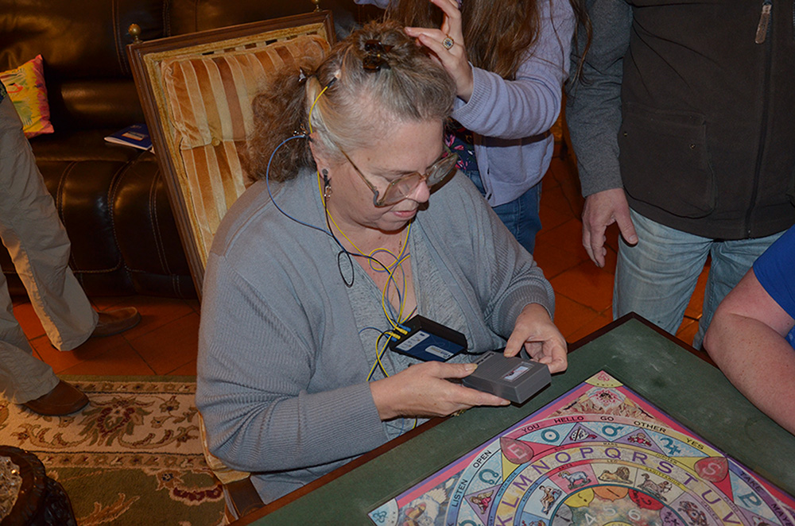
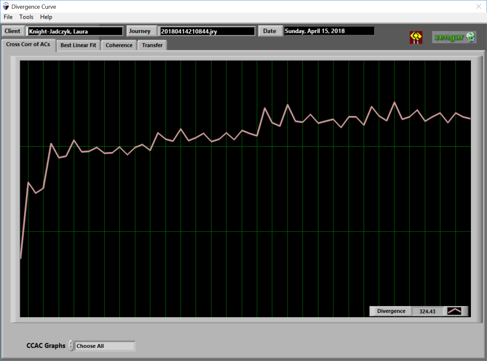
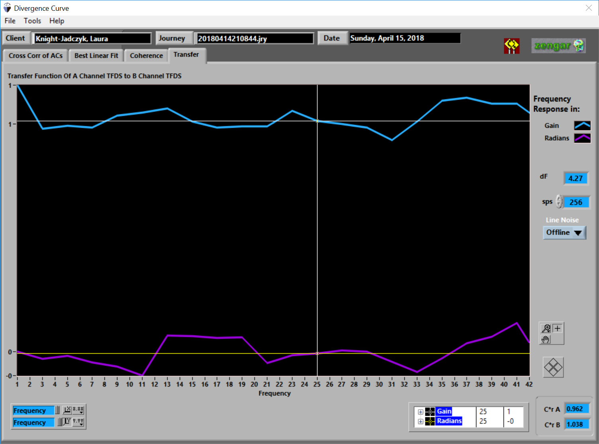
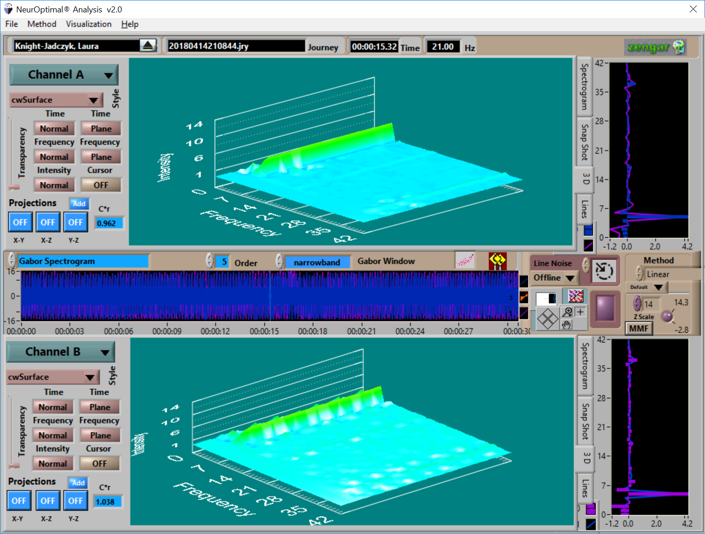
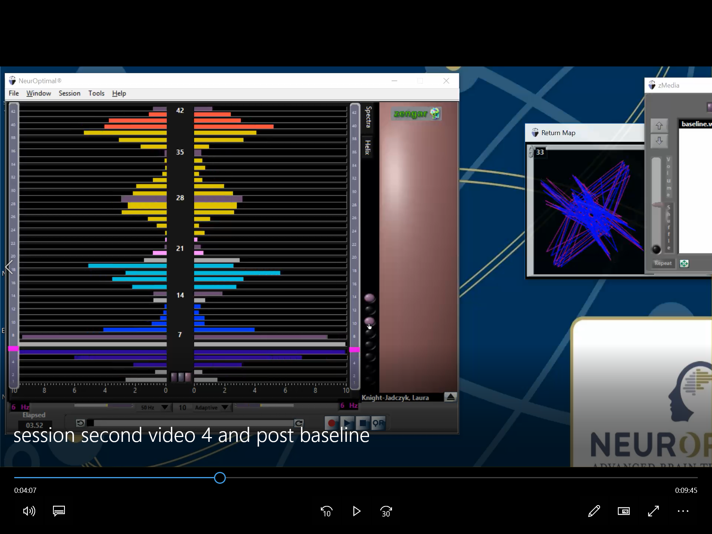
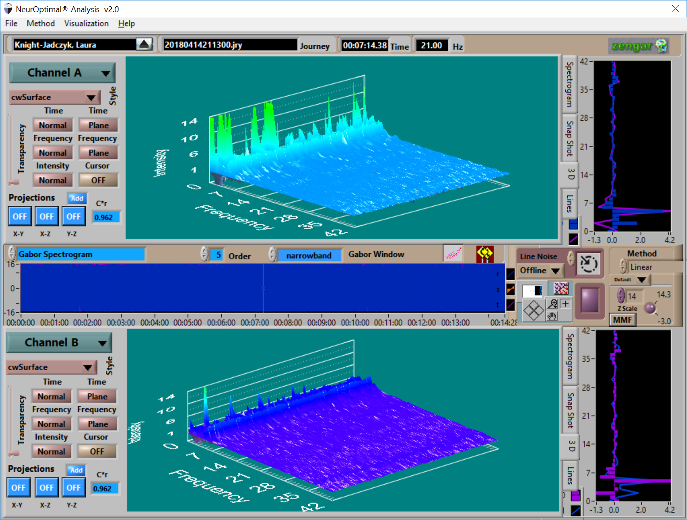
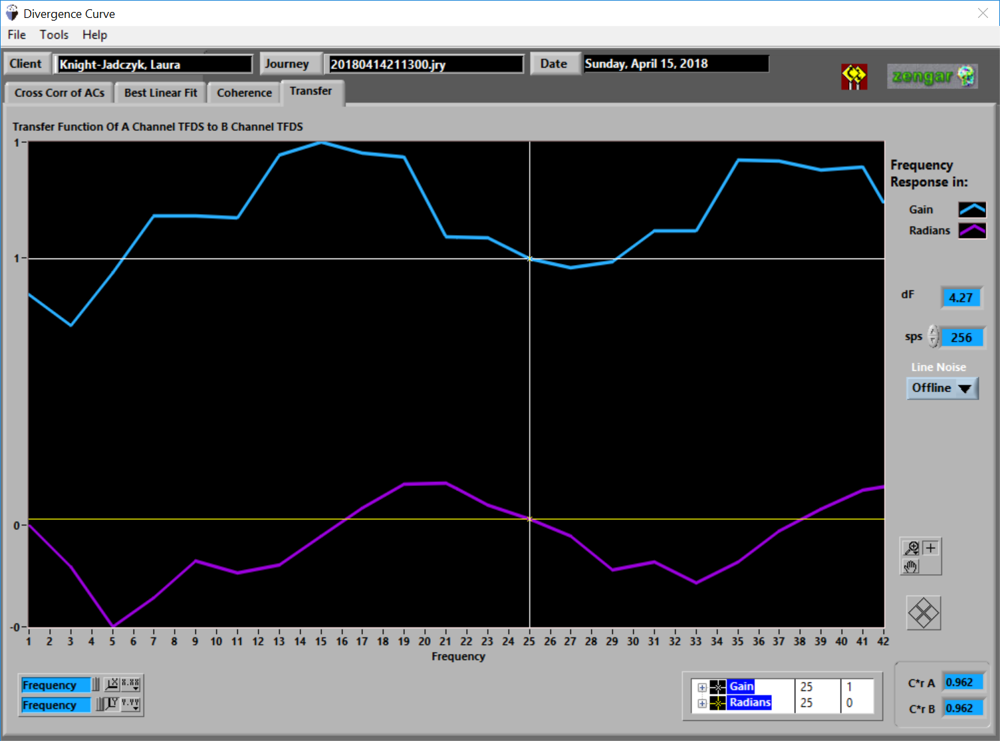
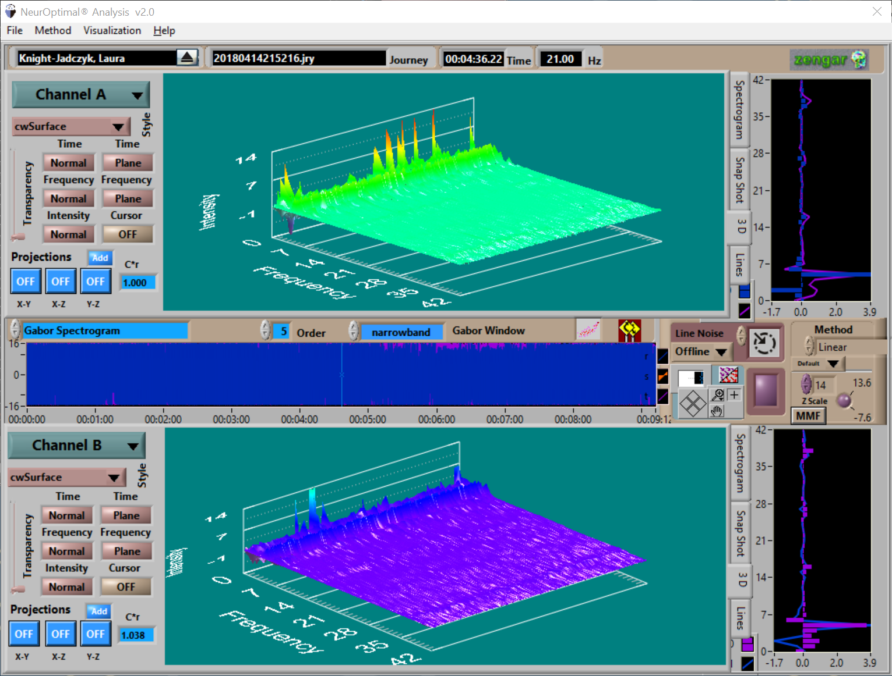
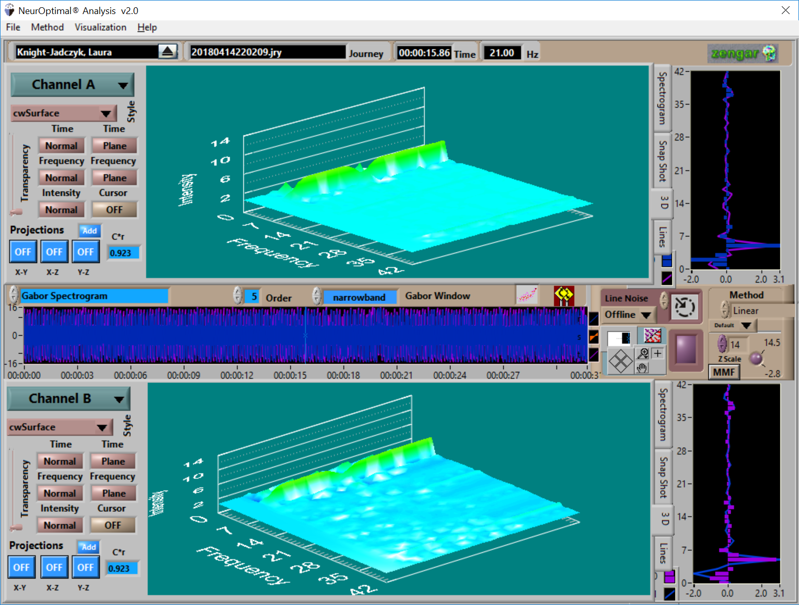

# 14 April 2018

## Summary of [14 April 2018 Cassiopaean Session](https://cassiopaea.org/forum/threads/session-14-april-2018.45814/#post-757646)

**Tags:** Dionysus Syndrome, STS Desperation, NeurOptimal Neurofeedback, Ethnic-Specific Weapons, Genetic Theories, Middle East Conflict, Quantum Wave Theory, Programmed Patsies

---

## Session Details

**Date:** April 14th, 2018

**Participants:** Laura, Andromeda, Artemis, Pierre, Joe, Chu, Ark, Mikey, Possibility of Being, Scottie, Niall, Noko the Wonderdog, The Lunar Module, Princess Leia

---

## Cosmic Structure & Densities

- **STS** forces would become desperate as the change approaches.
- **Balance** is coming at hyperdimensional and human levels.

---

## Health, Diet, and Supplements

- **NeurOptimal** neurofeedback may help people become immune to certain poisons, toxins, and possibly even sicknesses
- Neurofeedback can possibly protect people against **beaming**, **HAARP**, the flu, plague, and Ebola
- Flashes of light seen by participants were effects from **NeurOptimal** (excitation in ocular area of the brain)

---

## Control System & Sociopolitical Manipulation

- **Dionysius syndrome** activated: Earth reacting with chaos and madness
- **70%** of USA missiles in Syria were shot down
- Attack on **Syria** fed the Dionysus syndrome
- Avoidance of destruction is possible with **knowledge**
- The **Skripal** poisoning was conducted by Israeli spies without British cooperation
- Gas attack in **Douma** was only staged for video
- Clampdown on information sharing (e.g., banning **RT**, shadow banning) suggests war preparations and propaganda tightening
- The **U.S.** and **Israel** are desperate due to shifts in global power, trying to ignite conflict to maintain control
- **Iran** is the next major target, but such a war could destroy Israel
- Revolutionary movements often aim to destroy souled beings.
- Madness in the political sphere is seen as part of the “cleansing.”

---

## Esoteric Work & Personal Development

- Participants receive **frequencies** not included in the NeurOptimal program
- Sitting and channeling with the Cs during the session acts as neurofeedback.

---

## Books, Research, and Cultural Commentary

- Recent **Out of Africa** theory (**ROOA**) is false
- **Multiregional development** with gene exchange better explains human evolution
- Original human-primate split likely occurred in **China**
- Western belief in ROOA leads to flawed chemical and genetic weapon designs

---

## Notable Warnings or Predictions

- It is going to get VERY interesting very soon
- **Ethnic-specific genetic weapons** being developed by the U.S. based on false assumptions
- These weapons will backfire "**big time**"
- Reminder to "Stay alert and prepared for opportunity!"
- Knowing more in advance would not be healthy; current knowledge is sufficient.
- Big surprise coming due to incorrect assumptions about human ancestry.

---

## Technology and Artificial Intelligence

- **NeurOptimal** session revealed balance in brain hemispheres, excitation patterns, and subconscious activation
- NeurOptimal recordings showed unique activity during the session, confirming unusual neurofeedback effects

---

## Contact and Alien Interactions

- Communicating entity identified as **Klioppiaea** of Cassiopaea

---

## Genetics and Ancestry

- **ROOA** (Recent Out of Africa) theory declared false
- **Multiregional gene exchange** plays a significant role in human development
- **Ethnic-specific weapons** being developed are based on wrong assumptions about human genetics
- Surprise awaits developers when true ancestral origins are revealed

---

## Historical Insights

- The syndrome may reinterpret historical reports through a modern lens
- **Dionysian frenzies** noted in events like the French and Bolshevik revolutions and modern political behavior
- Dionysian cults involved chaos, madness, and cannibalism; referenced as an analogy for modern societal breakdown.

---

## Political Power Structures

- The **liberal faction** in the USA is a manifestation of Dionysus Syndrome
- Neocon war hawks (**Bolton**, **Pompeo**) intend to initiate war, particularly targeting Iran
- The **U.S.** is falling behind militarily and technologically compared to Russia and China
- Massive military spending may be futile due to lacking infrastructure and skilled workers

---

## End of Session

---
## Afterlife & Soul Topics

- No content under this heading in this session.

---

## Earth Changes & Environmental Events

- No content under this heading in this session.

---

## Environmental & Industrial Events

- No content under this heading in this session.

---
