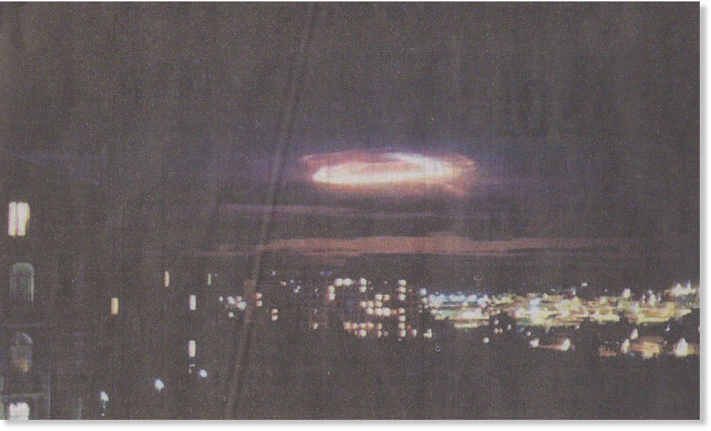

# 3 January 2009

## Summary of [3 January 2009 Cassiopaean Session](https://cassiopaea.org/forum/threads/session-3-january-2009.11560/)

**Tags:** 4D manipulation, EM frequency attacks, diet and health, spiritual warfare, righteous anger, WiFi danger, esoteric and political integration, soul development

---

## Session Details

**Date:** January 3rd, 2009

**Participants:** Laura, Ark, family, Chateau Crew, a guest

---

## Afterlife & Soul Topics

- The process of seeing one's true self involves the "death" of the false personality.
- The mirror is the most reliable way of seeing one's true reflection, both literal and metaphorical (QFS use).
- Seeing your soul requires interaction with others—esoteric growth cannot be done **alone**.

---

## Cosmic Structure & Densities

- Each participant present has a specific **role** in the coming "cosmic drama."
- The "program" is currently being constantly **meddled with**, causing phenomena such as increased déjà vu.

---

## Earth Changes & Environmental Events

- 2009 is going to be a "**smashing**" year.
- The "Biting Through" I Ching hexagram may apply more to those who are **unprepared**.
- A possible **comet** may occur.
- Recent major storm in France noted as possibly relevant.

---

## Health, Diet, and Supplements

- One participant needs more natural, balanced **protein**—preferably from meat.
- Amino acid supplements not sufficient; meat is better.
- Preferences against meat may not be "**their own**."
- Emotional manipulation and physiological effects can occur via **EM frequencies**.
- Specific individual should avoid harmful foods that affect their system.
- Up to 6 grams of **vitamin C** per day is appropriate.
- **Silk** is advised for health protection, including silk scarves and bed drapery.
- **Faraday cage**–like solutions, such as silk, can offer electromagnetic protection.
- Wearing thin silk around the throat is recommended.
- Genetic connections can make individuals susceptible to shared physical effects.

---

## Control System & Sociopolitical Manipulation

- Full spiritual work requires awareness of surrounding **political and worldly conditions**.
- Esotericism should not be separate from political awareness.
- "True religion" includes a curious and aware approach to the **real world**.
- There are "those out there" who want this work to **stop**, both on and off planet.
- Attacks can be subtle, "**insidious**," and aimed at individuals to remove them from play.

---

## Esoteric Work & Personal Development

- **Righteous anger** can function as a mental block against manipulations.
- The idea that "the fate of the universe may depend on you" is intended to strengthen resolve.
- Dealing with anxiety involves both diet and awareness of genetically linked shared effects.
- "**Mental blocking**" is a core method of protection against EM and other hyperdimensional attacks.

---

## Books, Research, and Cultural Commentary

- I Ching reading for 2009: "**Biting Through**"—you must chew once the bite is taken.

---

## Notable Warnings or Predictions

- 2009 described as a "smashing" year, possibly involving comets or significant **disruptive events**.
- Participants are being targeted due to their role in important esoteric work.
- One should not **underestimate the opposition**.
- EM frequency attacks can include "**beaming**," "hitchhikers," image projection, and emotional manipulation.
- One participant was advised to use a Faraday-like silk covering and maintain distance (**2 meters**) from EM-emitting devices such as USB antennae.
- Birthdates and numerological/astrological elements may contribute to susceptibility.

---

## Technology and Artificial Intelligence

- WiFi is described as "**Very bad!!!!!!!!!!**"
- USB stick antennas also emit harmful radiation.
- Cell phone towers pose constant exposure risk.
- Silk and "cancelling frequencies" can help **mitigate effects**.
- **Mulberry silk** is recommended due to protective properties.

---

## Contact and Alien Interactions

- "They" who wish to halt the work include both **on-planet and off-planet** beings.
- Hyperdimensional interference includes emotional manipulation, image projection, and **energy draining**.

---

## End of Session

